# VisualOdometrycpp
This repository contains c++ implementation of Visual odometry for KITTI dataset following the approach of minimizing the 3D to 2D reprojection error.

# Results
The following are the results on different KITTI sequences

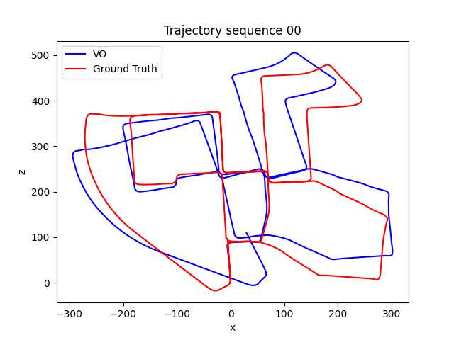
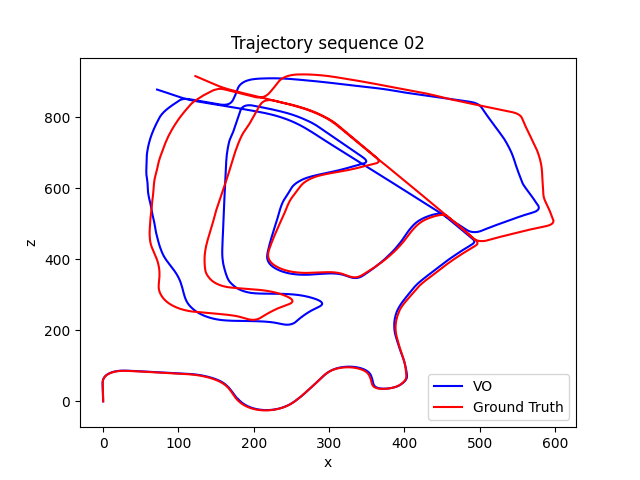

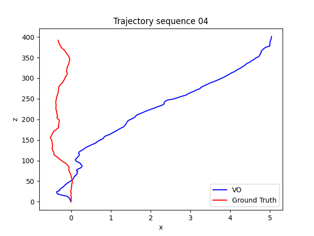
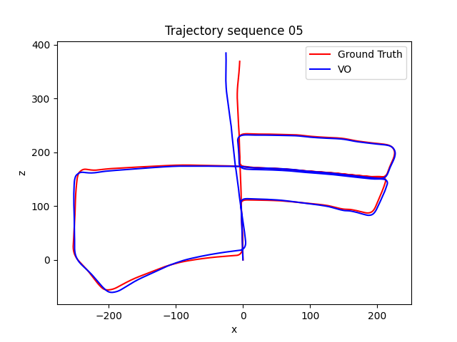
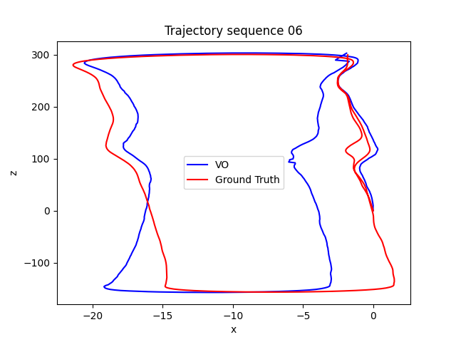
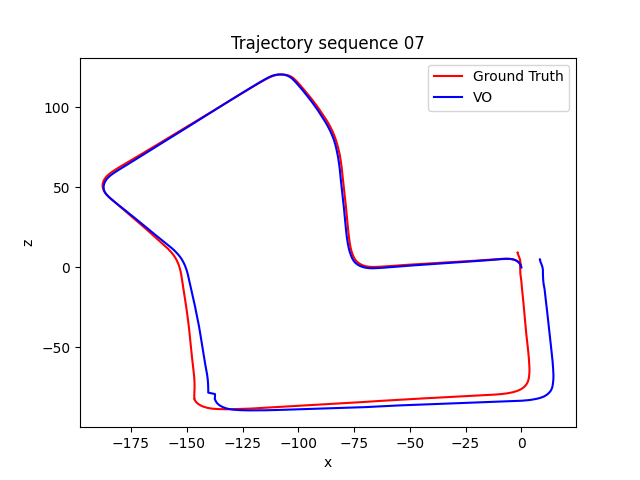
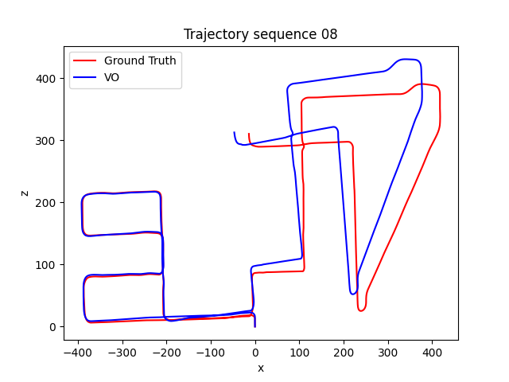
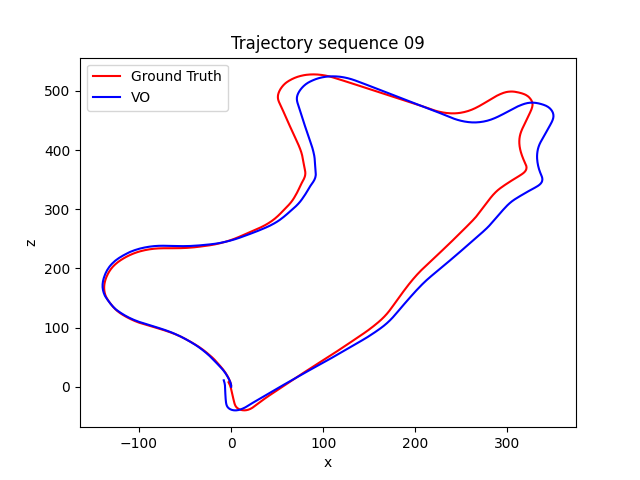
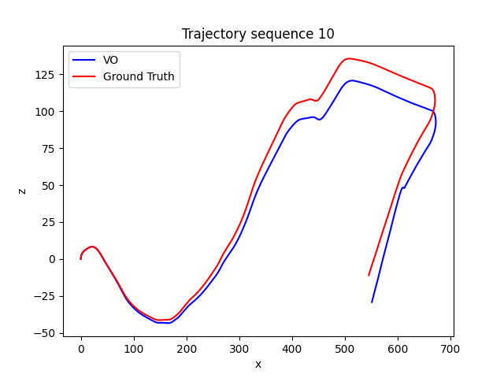
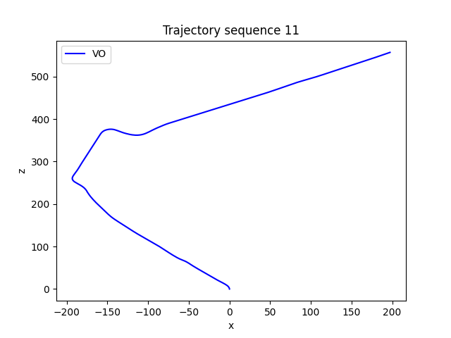
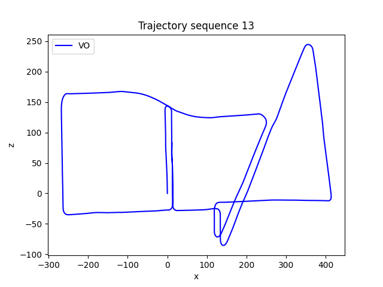

